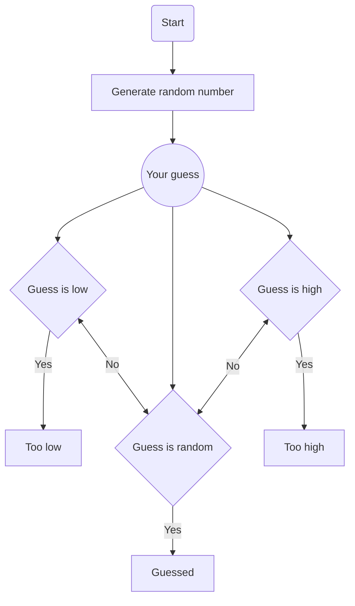

# Guess The Number
[Guess The Number](https://haithamaouati.github.io/GuessTheNumber/) game in HTML, CSS and JavaScript.

I am thinking of a number between 1-100.

Can you guess it?

## Table of Contents
- [Flowchart](#flowchart)
- [Author](#author)
- [License](#license)

## Flowchart
How it works?

## Author
Made with :hearts: by **Haitham Aouati**

## License
Guess The Number is licensed under the
[MIT License](LICENSE).
